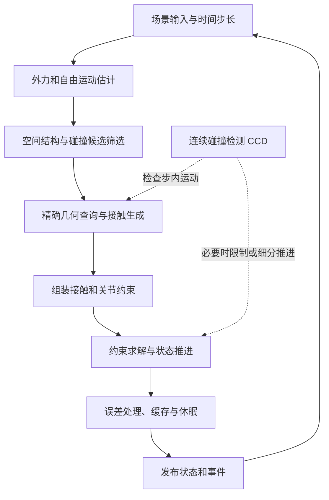

# 物理引擎如何工作：从物体建模到一次完整仿真

> 面向有开发经验、尚未系统学习物理仿真的读者。以实时游戏中的刚体仿真为主线，延伸到布料、软体、流体和多物理交互。重点解释各环节的职责、输入输出、常见技术与取舍，不要求读者实现引擎。
>
> 调研日期：2026 年 9 月 27 日。资料以引擎官方文档、算法作者的论文及技术报告为主。版本相关实例采用 Box2D 3.1.0 文档、PhysX 5.4.1 文档及 MuJoCo 3.6.0 文档；它们用于说明具体设计，不代表所有引擎，也不表示这些是最新版本。本文的流程图与贯穿案例是对多份资料的综合解释。

## 阅读导航

- 第 1—3 节：物理引擎是什么、如何表示世界、整体流程是什么。
- 第 4—10 节：沿着一次仿真，理解时间推进、碰撞检测、接触、求解和输出。
- 第 11—13 节：理解不同求解路线、不同物理对象以及性能与精度的取舍。
- 第 14—15 节：用完整例子检验理解，并建立后续阅读路线。
- 文末：按主题整理的一手资料与延伸阅读。

## 1. 什么是物理引擎

物理引擎是一套根据**物理模型、当前状态和外部作用，计算系统如何随时间变化的软件系统**。

把一个箱子放在空中，引擎需要决定：它如何下落，什么时候接触地面，会不会反弹，会不会侧翻，滑动多久才停止，以及它能否撑住另一个箱子。用户通常只提供形状、质量、初始状态和少量材料参数，连续的运动由仿真产生。

可以把这个过程概括为：

**当前状态 + 物理模型 + 外部输入 + 时间步长 → 下一时刻的状态与事件。**

这里的“物理模型”尤其重要。现实中的木箱会微小变形、发热、发声，材料内部也有复杂结构；游戏中的刚体箱子通常只保留整体平移、转动、接触和摩擦。仿真结果首先受建模假设限制，然后才受数值算法精度限制。

### 1.1 物理引擎、碰撞检测与渲染分别负责什么

渲染系统根据场景生成图像；碰撞检测系统回答几何体之间的距离、相交和接触问题；物理仿真还要根据质量、速度、外力和约束，决定接触之后如何运动。

因此，“两个物体相交了”只是几何事实。要让箱子停在地面上，还需要计算支撑作用，并更新运动状态。碰撞库也可以独立使用，例如射线选取或角色探测，并不要求场景中的对象都参与动力学。Box2D 将碰撞功能设计成可以脱离刚体仿真使用的模块，PhysX 也提供独立的场景查询接口。[Box2D Collision][r02]、[PhysX Scene Queries][r13]

### 1.2 为什么实时物理通常接受近似

实时应用必须在有限时间内完成计算。面对大量接触与复杂约束，引擎往往限制迭代次数，并通过简化几何、缓存、子步和休眠控制成本。

评价结果时，应分别看四件事：运动是否符合目标物理行为，数值是否稳定，计算能否按时完成，以及相同输入能否产生所需程度的可重复结果。这些目标并不总能同时最优。例如，一个不爆炸但明显过软的关节系统可以是稳定的，却仍不够准确。

本文使用“实时刚体流程”作为入口。机器人仿真可能更重视执行器、关节坐标和接触力；离线流体与工程仿真可能允许更高成本。它们共享建模、离散化、求解和验证的思想，具体管线会有不同。

## 2. 引擎如何表示一个物理世界

仿真开始之前，必须先把可见场景转化为可计算的物理模型。

### 2.1 刚体：保存运动状态与质量分布

三维刚体通常包含质心位置、朝向、线速度、角速度、质量和惯性张量。质量影响平移响应，惯性张量描述绕不同方向旋转的难易程度。同质量的细杆与实心球，转动行为不会相同。

**刚体假设**意味着物体内部各点的相对距离不变。整个物体因此可以用少量状态描述，无须单独模拟每个渲染顶点。PhysX 的刚体文档将质量、质心与主惯性轴作为明确的质量属性。[PhysX Rigid Body Dynamics][r03]

### 2.2 形状：告诉引擎哪里能发生接触

碰撞形状不必等于渲染模型。一个外观复杂的箱子可以使用长方体碰撞形状；机械零件可以使用若干凸体拼合；地形可以使用高度场或三角网格。

常见选择包括球、胶囊、盒体、凸包、复合形状、三角网格和有符号距离场。简单形状便宜且易于产生稳定接触；复杂表示保留更多几何细节，但增加查询、存储或接触处理成本。

资源预处理也属于这一步：生成凸包或凸分解，构建网格加速结构，计算质量属性，清理退化几何。不同引擎对动态非凸对象的支持不同，不能将“支持三角网格查询”直接理解为“支持任意动态三角网格仿真”。[PhysX Rigid Body Collision][r04]

### 2.3 运动类型：谁决定物体怎样移动

- **静态物体（Static）**：不由动力学推进，常用于地面和建筑。
- **动态物体（Dynamic）**：运动由力、冲量和约束共同决定，常用于箱子和碎片。
- **运动学物体（Kinematic）**：运动由外部指定，例如沿轨迹移动的平台；与动态物体交互时通常不会被其反推改变轨迹。

这是运动控制权的区别，不是同一对象的三个精度等级。直接覆盖动态物体位置，也不等价于通过力或运动学目标让它移动；覆盖可能意味着瞬移，缺少应有的路径交互。[Box2D Simulation][r01]

### 2.4 材料与约束：定义交互规则

碰撞材料通常提供摩擦、恢复系数等参数。恢复系数主要影响碰撞时法向相对运动的反弹程度；摩擦影响接触面的相对滑动。两种材料接触时如何组合参数，是具体引擎的规则。

约束则描述允许的运动，例如铰链只允许某种相对转动，距离约束限制两个连接点的间距，接触约束限制相互穿透。关节还可以包含限位、弹性、阻尼和电机。电机给出运动目标，但实际效果仍受力或力矩上限、负载及求解精度影响。[Box2D Overview][r25]、[Modeling and Solving Constraints][r09]

## 3. 一次仿真的整体流程

先建立一个概念流程：

这张图表达的是**职责关系**，不是所有引擎都严格遵守的函数调用顺序。

在常见速度级刚体方案中，可以先根据当前位姿生成接触，施加外力更新速度，求解接触和关节，再推进位置。在位置级方案中，常见顺序是先预测位置，再修正位置并更新速度。碰撞检测可能使用当前位姿、预测位姿或运动范围；子步也不一定重新执行全部碰撞流程。

例如 Box2D 的官方流程明确区分接触更新、岛管理、约束求解和变换更新，并在特定阶段处理连续碰撞；MuJoCo 则围绕多体动力学、约束力和积分组织计算。[Box2D Simulation Loop][r01]、[MuJoCo Computation][r15]

阅读任何引擎时，比记住固定顺序更有用的是追踪四类数据：**物体状态、候选对、接触信息和约束解**。

## 4. 时间推进：这一轮到底模拟多久

### 4.1 渲染帧、物理步与求解迭代是三件事

渲染帧负责显示图像；物理步负责推进一段模拟时间；求解迭代负责进一步改进某个离散问题的近似解。

假设物理主步长是 1/60 秒，将一个主步分为 4 个子步，每个子步是 1/240 秒。反过来，在同一个主步内做 4 次求解迭代，模拟时间并不会变成 4/60 秒。这是一个说明概念的例子，不是通用参数建议。

子步让系统沿时间方向更频繁地更新；迭代让约束之间的影响传播得更充分。增加其中一个，不能普遍替代另一个。Small Steps 论文针对位置约束系统展示了多次小步的优势；结论需要放在其方法和测试条件下理解。[Small Steps in Physics Simulation][r12]

### 4.2 固定步长为什么常用

如果直接把每个渲染帧的耗时传给物理系统，帧率变化就会改变离散误差和部分算法的表现。固定步长有助于让仿真的数值条件更一致。

常见做法是累计实际流逝时间，每够一个物理步长就推进一次；渲染读取已有状态，并在需要时插值。若物理持续算不完，积压时间会越来越多，因此系统必须保留性能余量，或明确限制追赶步数及其对模拟时间的影响。[Fix Your Timestep!][r05]

固定步长只是可重复仿真的一个条件。对象顺序、输入时刻、浮点运算和引擎实现也会影响确定性，后文会再区分。

## 5. 外力与积分：没有障碍时物体会去哪里

### 5.1 自由运动是整个步骤的起点

先暂时忽略地面和关节，箱子会在重力作用下下落。其他输入可能包含推力、空气阻力、弹簧力和外部冲量。

**力**描述持续作用，必须结合时间才能得到速度变化；**冲量**描述动量变化，可以直接改变速度。作用点偏离质心时，还会改变角运动。因此“给物体一个力”不只需要大小和方向，也可能需要作用点。

### 5.2 数值积分把连续运动变成离散更新

以平移为例，半隐式欧拉的简化形式是：

$$
\mathbf v^* = \mathbf v_n + h\,\mathbf a_n,
\qquad
\mathbf x_{n+1} = \mathbf x_n + h\,\mathbf v_{n+1}.
$$

其中 $h$ 是步长，$\mathbf v^*$ 是仅考虑外力的候选速度；存在接触或关节时，$\mathbf v_{n+1}$ 还要包含约束造成的速度变化。旋转有自己的角动力学与姿态更新，不能简单地用三维位置公式替代。

显式欧拉便宜，但在弹簧等系统中容易出现明显能量误差。半隐式欧拉仍然便宜，常用于实时运动推进。RK4 等高阶显式方法可以提高光滑运动问题的积分精度，但不会自动解决碰撞、约束或刚性系统带来的困难。[Integration Basics][r06]

隐式方法将下一时刻的状态纳入求解，对某些高刚度系统更有利，代价是要解线性或非线性问题。经典布料研究就把隐式积分与稀疏线性系统结合，以缓解小步长限制。[Large Steps in Cloth Simulation][r18]

**积分器回答如何沿时间推进，碰撞系统回答哪里产生交互，约束求解器回答交互如何改变运动。**三者需要配合。

## 6. 碰撞检测：先排除大多数，再仔细检查少数

### 6.1 过滤：哪些对象根本不必交互

碰撞层、类别掩码、对象组和自碰撞规则用于提前排除不需要的交互。例如装饰性粒子可能只需与场景碰撞，角色身体内部的一些相邻部件可能无需互相检测。

触发器也应与实体接触区分：进入一个任务区域可能只需要事件，不需要阻挡玩家。查询过滤与仿真过滤可能分别配置。过滤会分布在多个阶段，不一定只有一个独立的前置函数。[PhysX Rigid Body Collision][r04]

### 6.2 宽相：哪些对象可能碰撞

若有 $N$ 个对象，暴力两两检查需要 $N(N-1)/2$ 对。宽相（Broad Phase）用便宜的包围体测试，尽量排除明显不可能接触的对象。

最常见的包围体之一是 AABB，即与坐标轴对齐的包围盒。AABB 重叠只说明对象值得进一步检查，不说明真实形状已经接触。一个细长斜杆的包围盒中可能包含大量空白区域。

常见加速技术各有适合的场景：

- **扫描与裁剪（Sweep and Prune，SAP）**：把包围盒投影到坐标轴，利用排序后的区间寻找重叠。相邻步骤运动变化小，可以利用已有排序。
- **均匀网格与空间哈希**：根据空间位置将对象放入格子，只比较相关格子中的对象。适合尺度相近、分布较均匀的对象或粒子；大小悬殊或极度拥挤时，需要额外设计。
- **动态 AABB 树 / BVH**：用层次包围体组织对象，查询时整批排除空间区域。适合动态场景，也能复用到射线等查询中。

前两种方法的基本思想与最坏情况可见 NVIDIA 的宽相介绍；动态树可见 Box2D 的碰撞文档。[GPU Gems 3：Broad-Phase Collision Detection][r07]、[Box2D Collision][r02]

宽相的目标是保守筛选：允许多报一些候选，避免漏掉需要处理的交互。候选范围可能因接触容差或运动预测而膨胀。密集场景中，真正需要处理的候选本身就很多，空间结构不能消除这部分工作。

### 6.3 中间筛选：候选物体内部还有哪些局部可能接触

一个箱子和整片地形成为候选后，仍然不能让箱子与地形每个三角形逐一测试。网格内部的 BVH 或高度场结构会进一步找出相关三角形。

这个职责经常称为中相（Mid Phase），但并非每个引擎都把它作为单独命名的阶段。理解它的关键是区分**对象级筛选**与**对象内部几何筛选**。[PhysX Rigid Body Collision][r04]

### 6.4 窄相：这些形状到底如何接触

窄相（Narrow Phase）对候选使用更精细的几何算法。需要的结果通常包括接触位置、法线、分离距离或穿透信息，而不仅是一个布尔值。

**基础形状专用算法。** 球与球可以比较球心距离和半径和；胶囊与其他对象可以利用线段距离等结构。能够利用形状特性的算法通常更直接。

**SAT：分离轴定理。** 如果能找到一个方向，使两个凸体的投影互不重叠，就证明它们分离。对于凸多面体，需要考虑相应候选轴；求出接触特征后，还可以通过面裁剪生成接触点。[Contact Manifolds][r08]

**GJK：凸体距离与相交查询。** 算法通过支持映射获取形状在某方向的最远点，把两个凸体之间的问题转化为 Minkowski 差与原点的关系。它的基础能力包括凸体距离查询，不能只理解成“是否撞上”。[GJK 原始论文][r26]

**EPA：穿透信息估计。** 当凸体重叠时，EPA 常与 GJK 配合，进一步估计穿透方向和深度。它仍属于几何计算，并不负责质量、摩擦和碰撞后的速度。MuJoCo 的凸体碰撞管线提供了 GJK/EPA 的具体应用实例。[MuJoCo Computation][r15]

**SDF：有符号距离场。** 通过场值描述空间点与表面的距离及内外关系，可用于复杂形状的接触查询。若使用采样场，还要考虑分辨率、梯度误差、存储与薄结构表达。SDF 是几何表示，不是约束求解器。[PhysX GPU Simulation][r23]

这些技术通常组合使用，而不是从中选择一个包办所有对象。非凸物体还需要凸分解、三角网格层次结构或其他专门表示。

## 7. 接触管理与 CCD：从几何结果形成可靠交互

### 7.1 为什么“找到一个碰撞点”还不够

箱子平放在地面上，实际存在一片接触区域。如果只选一个点支撑它，转动与堆叠可能不稳定。引擎通常用少量有代表性的点近似接触区域，构成**接触流形（Contact Manifold）**。

好的接触集合需要覆盖合理的位置，并在相邻步骤之间保持连贯。常见技术包括面裁剪、接触点缩减、特征标识和局部坐标锚点。这些信息让引擎识别“这一轮的接触是否延续自上一轮”。[Contact Manifolds][r08]

持续接触流形（PCM）进一步缓存、更新接触；旧点失效后补充新点，必要时重新生成。它减少重复工作，但接触点数量与质量仍会影响堆叠。[PhysX Advanced Collision Detection][r10]

### 7.2 穿透通常是时间采样问题

假设一个物体以 60 米/秒运动，物理步长为 1/60 秒，它一次就移动约 1 米。如果墙只有 5 厘米厚，仅检查起点和终点可能都没有重叠，但路径已经穿过墙。

这是离散碰撞检测的典型漏检。增加约束迭代没有帮助，因为求解器根本没有收到这面墙的接触约束。

### 7.3 连续碰撞检测有哪些路线

**扫掠与首次碰撞时刻（TOI）。** 在给定的运动假设下，检查步内路径，寻找首次接触时间，再限制推进或处理剩余时间。保守推进可以利用距离与运动界逐步接近碰撞。支持哪些形状、如何处理转动和多次撞击，取决于实现。[Continuous Collision][r11]

**预测接触（Speculative Contact / Speculative CCD）。** 在物体尚未真正接触时，就根据运动与距离建立约束，让求解器尽量阻止下一步穿透。它便于与离散管线结合，但可能产生不必要的提前响应，也不能保证覆盖所有后续加速或复杂运动。[PhysX Advanced Collision Detection][r10]

缩小步长也能降低漏检风险，但单靠有限子步不构成所有速度和几何条件下的防穿透保证。阅读“支持 CCD”时，要继续确认它覆盖的是哪类对象与运动。

## 8. 约束构建：把接触关系转成运动条件

### 8.1 接触和关节为什么能进入同一个求解框架

接触限制物体继续向对方内部运动；铰链限制不允许的相对自由度；距离约束限制连接点间距。它们都能表述为对状态或状态变化的条件。

约束准备阶段把几何和属性整理成求解器使用的数据，例如约束方向、接触点相对质心的位置、相对速度、质量与惯性、误差量，以及允许的力或冲量范围。

这里经常出现两个词：**Jacobian（雅可比）**描述物体运动怎样转化为约束方向上的相对运动；**有效质量**描述在这个方向施加单位作用后，约束运动会改变多少。有效质量需要考虑两个物体及接触点的力臂，不能只拿总质量代替。[Modeling and Solving Constraints][r09]

### 8.2 接触是单边约束，摩擦还有上限

普通无黏附接触可以推开物体，不能隔空把它吸回来。摩擦则受法向支撑强度限制。用冲量表示，库仑摩擦的理想化边界可写为：

$$
\|\mathbf p_t\| \leq \mu p_n,\qquad p_n \geq 0.
$$

其中 $p_n$ 为法向冲量，$\mathbf p_t$ 为切向冲量，$\mu$ 为摩擦系数。需要较小摩擦就能阻止滑动时，可以维持静止；不足以阻止滑动时，则进入滑动响应。

三维摩擦涉及切向平面。一些方法使用摩擦锥，一些用便于求解的近似。恢复系数主要用于碰撞反弹，而持续静止接触并不应该每步都被当成一次猛烈撞击。不同接触模型的柔性、摩擦与恢复处理并不完全一样。[MuJoCo Computation][r15]、[Box2D Overview][r25]

### 8.3 仿真岛：哪些物体必须一起考虑

将物体看成节点，将接触与关节看成连接，彼此耦合的动态物体形成一个**仿真岛（Simulation Island）**。独立岛可以分别调度；稳定的岛可以成为休眠处理单位。

“同一个岛”不是“空间位置相邻”。两个离得很远的物体可能被关节连接，两个很近但没有约束关系的物体也可能独立。作为固定边界的共同地面，通常不需要把所有落在地上的动态物体合成一个巨岛。岛构建可以使用深度优先搜索、并查集，也可以跨步维护并增量合并、拆分。[Simulation Islands][r28]

## 9. 约束求解：为什么箱子最后能够站稳

碰撞检测告诉引擎“箱底与地面在哪里接触”；求解器要决定“为了满足接触条件，速度或位置应该怎样改变”。

### 9.1 顺序冲量与 PGS

顺序冲量（Sequential Impulses）每次处理一个约束：计算需要的冲量，限制到合法范围，再更新相连物体的速度。遍历多轮后，约束之间逐步协调。它与投影高斯—赛德尔（PGS）可以在相应问题表述下联系起来。

“投影”可直观理解为把更新后的解限制在允许区域。例如普通接触的累计法向冲量不能为负，摩擦冲量不能超过允许上限。

暖启动（Warm Starting）使用上一时间步的解作为初始猜测，对持续接触尤其有效。它需要可靠的接触匹配。暖启动和累计冲量管理都是改善实时迭代求解的重要技术。[Solver2D][r14]

### 9.2 为什么要迭代

假设三个箱子叠在一起。修正上面两个箱子的接触，会改变中间箱子的运动；修正中间箱子与最底下箱子的接触，又会反过来影响上面的接触。

一轮局部修正通常不能让所有条件同时满足。多轮迭代让影响沿约束网络传播，但实时预算下会留下残差。长链、较大的质量比、复杂堆叠或很硬的约束，都可能增加求解难度。

因此，判断求解器质量应该观察残余穿透、关节偏差、滑移和耗时。只看到一个稳定画面，无法判断它距离目标模型的解还有多远。

### 9.3 位置修正与稳定化

离散推进和有限迭代可能留下小穿透或约束漂移。常见处理包括将位置误差转成速度偏置的 Baumgarte 稳定化、单独的位置修正，以及具有可控柔度和阻尼的软约束。

这些方法都在处理误差，但影响不完全相同：过强的速度偏置可能注入额外动能；位置修正可能改变位形和势能；软约束主动允许一定偏差。它们需要与步长和求解方案共同理解。[Solver2D][r14]

## 10. 状态输出、休眠与场景查询

### 10.1 完成计算后，需要发布什么

常见输出包括物体位姿与速度、接触开始和结束、撞击、触发区域进出、关节断裂及休眠状态变化。游戏逻辑可以据此播放音效、计算伤害、切换动画或更新可视对象。

仿真常在工作线程或其他设备上运行，结果需要在定义好的同步点被读取。事件中保存的碰撞时刻信息，也可能与读取时对象的当前状态不同。PhysX 的回调文档专门区分接触事件数据与仿真步骤结束后的对象状态。[PhysX Simulation][r16]

### 10.2 休眠为什么有效

已经稳定的一堆箱子，不需要永远以相同成本重复计算。休眠根据低运动或低能量状态持续一段时间等条件，暂时跳过动力学更新；新的作用或接触变化可以将其唤醒。

休眠并不表示删除物体，也不等于永久改成静态对象。它是基于当前平衡状态的计算优化。若只根据某一瞬间速度小就休眠，可能错误冻结本应继续运动的物体。[PhysX Rigid Body Dynamics：Sleeping][r03]

### 10.3 显示平滑不等于仿真精度提高

在已有物理快照之间插值，可以减轻渲染频率与物理频率不同造成的视觉跳动；插值结果通常只供显示。它没有增加物理采样，也不能修复已经漏掉的碰撞。常见的前后状态插值还会带来约一个物理步的显示滞后。[Fix Your Timestep!][r05]

### 10.4 射线、扫掠和重叠查询属于哪一环

- **Raycast**：射线沿途命中了什么，常用于选取、视线或瞄准。
- **Sweep**：一个具有体积的形状沿路径移动时会遇到什么，常用于移动探测。
- **Overlap**：指定区域当前与哪些对象重叠，常用于范围检查。

它们复用几何与空间结构，但通常不会自动产生完整动力学响应。用 Sweep 阻止角色穿墙的角色控制器，可以拥有自己的移动规则，不必是一个完全自由的动态刚体。[PhysX Scene Queries][r13]

## 11. 不同求解路线分别在做什么

理解基本流程之后，再看算法名称就容易找到它们的位置。

### 11.1 PBD 与 XPBD：直接修正位置

PBD（Position Based Dynamics）的典型过程是预测位置，再按约束修正位置，最后根据位移更新速度。例如一条被拉长的绳段，会根据两端质量和约束关系，把端点向满足长度条件的位置移动。

这种组织方式便于控制几何误差，广泛应用于交互式变形模拟。但传统 PBD 的约束刚度表现会受到迭代次数、步长等因素影响；位置修正也不自动意味着能量和动量都得到精确保持。[Position Based Dynamics][r17]

XPBD 引入柔度及累计拉格朗日乘子，将约束与更明确的弹性能量、隐式离散联系起来，改善材料参数对迭代次数和步长的依赖。需要区分**参数定义的一致性**与**有限迭代后的实际误差**：使用 XPBD 后，减少迭代仍然可能留下更多误差，改变步长也仍会改变离散轨迹。[XPBD 原始论文][r19]

### 11.2 TGS：把时间细分纳入求解组织

TGS（Temporal Gauss-Seidel）强调在较小时间段上推进与求解；一些实现会在子步间更新缓存接触的分离量，从而避免每个子步都重做完整碰撞检测。

它不是增加一个碰撞算法，也不是把普通迭代改个名字。子步内哪些数据更新、哪些数据复用，是理解成本和误差的关键。Box2D 作者后来将其 `TGS_Soft` 方案称为 Soft Step，以强调软约束与子步的组合。[Solver2D][r14]、[Releasing Box2D 3.0][r24]

### 11.3 隐式优化、VBD 与 AVBD

另一种视角是：下一步状态应同时考虑惯性与材料能量，从而把推进写成一个优化问题。求解可使用 Newton 类方法、线性系统求解或局部块更新。

VBD（Vertex Block Descent）针对隐式欧拉的变分形式，以顶点块为单位进行局部更新，并组织并行计算。它说明“物理求解”也可以从能量优化和块坐标下降理解。[Vertex Block Descent][r20]

AVBD（Augmented Vertex Block Descent）在这一方向上引入增广拉格朗日方法，处理硬约束与较大刚度比，并展示了刚体接触、关节及软硬交互等应用。[Augmented Vertex Block Descent][r21]

这里介绍它们是为了展示求解路线的扩展。论文中的稳定性与性能结论有各自的模型、算法及测试条件，不能据此认定它们在所有场景都优于其他方案，更不能把数值稳定性理解成零误差或绝不穿透。

### 11.4 关节坐标与多体动力学

用每个刚体的独立位置和朝向表示系统，再用约束连接，是一种路线。另一种路线是用关节角、关节位移等广义坐标表示关节树，让部分几何连接关系直接包含在坐标中。

机器人和关节机构常采用这类多体表示，并使用递归动力学计算或结构化矩阵运算。但关节坐标不会让地面接触、摩擦、限位和闭环约束自动消失，仍然需要相应处理。[MuJoCo Computation][r15]

### 11.5 这些名称不处于同一层

可以用五个问题定位技术，而不必把所有缩写放在同一份排名中：

1. **模拟什么？** 刚体、弹性体、流体等物理模型。
2. **用什么表示？** 凸包、网格、粒子、距离场或关节坐标。
3. **怎样离散空间与时间？** 例如 FEM 和隐式欧拉分别处理不同层面的问题。
4. **怎样求解？** PGS、XPBD、Newton 类方法、VBD/AVBD 等。
5. **怎样加速？** BVH、缓存、SIMD、任务并行和 GPU。

因此 FEM 并不是 XPBD 或 VBD 的简单对立项；有限元产生的材料模型可以与不同的时间离散和数值求解方法组合。具体组合是否合理，仍由模型和算法决定。

## 12. 从刚体扩展到绳索、布料、软体和流体

基本思想仍然是“保存状态—计算交互—推进状态”，但数据表示与内部作用会变化。

### 12.1 绳索与布料：内部也存在相对运动

绳索可以由节点与连接关系表示，布料可以由三角网格节点表示。除了外部碰撞，还要描述拉伸、剪切、弯曲等内部行为；若要模拟绳子的扭转，还需要更丰富的方向或杆模型。

常见技术包括质点弹簧、PBD/XPBD 约束，以及基于连续体能量的隐式方法。选用哪种方法，会影响材料参数表达、刚度、计算成本和可控性。[Position Based Dynamics][r17]、[Large Steps in Cloth Simulation][r18]

### 12.2 软体：材料内部如何抵抗变形

软体允许内部节点相对移动，因而需要体积、拉伸和剪切等材料行为。FEM（有限元法）把连续物体划分成有限单元，在单元上近似描述变形与材料响应。

三维体积软体常使用四面体网格。用于求解的网格、用于碰撞的网格、用于渲染的网格可以不同，通过映射联系起来。这样既能保留外观细节，也能控制自由度与接触成本。PhysX 的软体文档给出了这类分离设计的实例。[PhysX Soft Bodies][r27]

### 12.3 流体：问题从“不能穿透”扩展到密度和流动

水的基本行为不能仅靠许多小球彼此碰撞得到。流体模型还要处理压力、密度、黏性和边界等因素。常见图形学路线包括：

**SPH（光滑粒子流体动力学）。** 使用粒子及邻域核函数估计密度等场量，再计算相互作用。邻域搜索通常是重要成本，因此网格和空间哈希在这里不仅用于碰撞，也用于材料内部计算。[Particle-Based Fluid Simulation][r22]

**PBF（Position Based Fluids）。** 将近似恒定密度写成位置约束并迭代修正粒子，适合交互式流体效果。它仍然要处理邻域、边界和速度相关效果；“基于位置”不意味着这些工作消失。[Position Based Fluids][r29]

**网格方法与 PIC/FLIP。** 网格上保存速度、压力等量，典型不可压缩流程包含输运、外力和压力投影；压力求解调整速度场，使其更接近无散度条件。PIC/FLIP 将粒子运动与网格计算结合，处理粒子和网格之间的信息传递。[Fluid Simulation for Computer Animation][r30]

这些分支的共同困难是：有限分辨率怎样保留细节、边界怎样处理，以及有限计算预算下怎样控制压缩、耗散或噪声。它们并非刚体管线中替换一个碰撞函数就能获得的能力。

### 12.4 颗粒、雪与 MPM

沙、雪和泥等材料可能同时表现出流动、堆积、弹性或塑性。MPM（物质点法）使用携带材料状态的粒子，并借助背景网格进行计算，适合研究大变形及复杂材料行为。

雪模拟论文是这条路线的经典实例。本文仅用它说明材料模型和离散方式的扩展，不将其视为一般游戏刚体引擎必须具备的功能。[A Material Point Method for Snow Simulation][r31]

### 12.5 多种系统共存，不等于双向耦合

以下是基于上述模型的综合说明：布料能够碰到刚体，不一定代表布料也能推动刚体；水能绕过物体，不一定代表水的反作用会让物体漂移。

单向耦合把一个系统当成另一个系统的给定边界；双向耦合需要交换反作用，并协调时间步、质量分配、接触与求解顺序。例如软体撞击刚体时，双方都改变运动；若其中一侧晚一步才收到反馈，就引入了额外的时间近似。

因此，多物理系统的重点除了各自的求解器，还包括**交互条件怎样建立，以及反作用怎样参与双方推进**。AVBD 的软硬交互示例展示了一种统一处理方向，但不是唯一组织方式。[Augmented Vertex Block Descent][r21]

## 13. 为什么实际引擎还需要大量工程技术

### 13.1 性能取决于数据与依赖关系

同一种算法的不同实现，性能可以相差很大。对象数据布局、缓存命中、分配次数、任务粒度和同步成本都可能成为瓶颈。

CPU 上的常见手段包括连续数组、适合批处理的数据布局、SIMD、任务系统和仿真岛并行。一个岛内部还可以使用图着色，把不会同时修改同一动态物体的约束分为可并行处理的批次。Box2D 3.0 的发布说明讨论了数据布局、图着色与 SIMD 如何共同作用。[Releasing Box2D 3.0][r24]

Gauss-Seidel 类更新会立即使用新结果，收敛与顺序有关；Jacobi 类更新从一份旧状态并行计算，再合并结果，更容易并行，但传播方式不同，可能需要更多迭代或其他补偿。并行设计因此不只是把循环分给更多线程。[GPU Gems 3：Broad-Phase Collision Detection][r07]

GPU 适合足够大、能有效并行的数据工作负载。引擎可以分别加速宽相、接触生成或求解；哪些功能实际在 GPU 上执行，由产品版本决定。传输、同步和 CPU 侧依赖也计入总成本，不能只用某个计算内核的速度代表整步性能。[PhysX GPU Simulation][r23]

### 13.2 精度问题需要先定位层次

下列现象是诊断线索，不是唯一原因的判定：

- **高速对象穿墙**：先查步内运动是否被检测、CCD 覆盖范围与几何厚度；未生成接触时，增加求解迭代无从修复。
- **箱子堆叠抖动**：可能涉及接触点连贯性、暖启动、恢复阈值、质量比、误差修正或求解不足。
- **关节或绳链拉长**：可能涉及模型柔度、约束网络传播不足、步长或驱动力上限。
- **物体看起来悬空**：可能涉及碰撞形状与外观不匹配、接触偏移或显示插值。
- **仿真突然弹开**：可能涉及初始重叠、瞬移或过强的误差修正，不能仅凭现象认定是碰撞检测错误。

这些判断来自前述阶段职责的综合推理。实际排查应观察碰撞几何、接触点与法线、约束误差、速度和每阶段耗时，并通过可复现的小场景区分原因。

### 13.3 更高精度要说明提高的是哪一种精度

缩小步长主要改变时间离散；增加迭代主要减少当前求解残差；细化网格改变空间离散；改进碰撞表示改变接触几何；更完整的材料模型则改变系统本身能够表达的行为。

它们不是一个统一的“质量滑块”。用更多迭代，不能把刚体自动变成可变形材料；用更细的模型，也不能保证大步长下运动准确。

评估时应同时记录效果和成本。例如用下落、反弹、斜面滑动、堆叠及关节摆动等场景，分别检查目标运动、接触误差、能量变化与耗时。改变参数时一次只改变一类因素，才能理解改善来自哪里。

### 13.4 确定性不是只设一个固定步长

“同一程序重复运行一致”“不同线程配置一致”“跨平台逐位一致”“支持回滚后完全重演”是不同要求。

PhysX 5.4.1 明确描述了其确定性的适用条件，包括同一平台、同一版本、相同场景插入顺序和时间推进方式；增强确定性又有额外规则与成本。固定步长有帮助，但不能替代这些条件。[PhysX Rigid Body Dynamics：Enhanced Determinism][r03]

## 14. 贯穿案例：一个箱子从下落到静止

下面是概念性走读，不对应任何引擎的逐行调用顺序。

**场景建立。** 地面是静态碰撞形状；箱子是动态刚体，包含质量、惯性、盒体形状与材料。外观模型可以比盒体复杂。

**尚未接近地面。** 重力改变箱子的速度，积分推进运动。空间结构维护箱子的范围，碰撞系统排除无关对象。

**接近地面。** 宽相生成箱子与地面的候选对；窄相计算底部与地面的距离或接触。若一步跨越地面，CCD 或预测接触必须参与，否则可能漏检。

**第一次碰撞。** 接触点与法线被转换为约束。求解器根据接近速度、质量分布和恢复规则改变运动；接触点偏离质心时，还会改变转动。碰撞可能让箱子反弹或侧翻。

**滑动与持续接触。** 摩擦限制相对滑动，新的接触点逐渐替换旧点。持续接触缓存和暖启动帮助求解；有限误差由相应稳定化处理。

**达到静止。** 忽略其他作用，在一个简化竖直支撑模型中，单步累计支撑冲量大致抵消重力冲量，其量级约为 $mgh$。这是支撑平衡的离散解释，不代表箱子每步都发生一次可见反弹，也不是所有求解器都显式存储这个量。

**进入休眠。** 箱子满足稳定条件后，系统减少重复计算；后续推力、碰撞或支撑变化可以将其唤醒。渲染系统持续显示已发布状态。

这个例子把引擎各部分连接起来：几何决定接触在哪里，物理模型决定允许怎样交互，数值求解决定怎样近似满足这些条件，工程系统保证过程能够持续运行。

## 15. 读完后，应该能够回答哪些问题

遇到一个新引擎或一篇算法论文，可以按下面顺序建立理解：

1. **它模拟什么现象？** 刚体、变形、流动，还是其中一部分？
2. **它保存哪些状态？** 刚体位姿、网格节点、粒子状态，还是关节坐标？
3. **它怎样找交互？** 宽相、窄相、邻域搜索和连续检测分别如何组织？
4. **它怎样表达交互？** 接触、力、弹性能量、密度约束或其他条件？
5. **它怎样推进与求解？** 步长、子步、迭代、缓存与误差控制怎样配合？
6. **它的结果在哪些条件下可信？** 验证过哪些现象，接受哪些误差，成本与确定性条件是什么？

如果只想继续理解日常游戏中的刚体行为，优先阅读 Box2D 的流程、Catto 的接触与约束材料。若关注机器人关节与接触力，再看 MuJoCo 的计算模型。若关注布料、软体或流体，再分别进入材料模型与对应离散方法，无须先实现一套完整引擎。

## 资料来源与延伸阅读

以下链接在本次调研中用于核对概念或具体实例。正文为综合改写；示意案例、诊断思路及技术层次划分是解释性归纳，不是某个引擎的功能承诺，也不包含本文自行测得的性能排名。

### 引擎概念、流程与工程组织

- [Box2D 3.1.0 — Overview][r25]：世界、约束、事件及基本术语。
- [Box2D 3.1.0 — Simulation][r01]：物体类型、时间步、接触和实际仿真流程。
- [PhysX 5.4.1 — Rigid Body Dynamics][r03]：质量属性、运动学物体、休眠和确定性条件。
- [PhysX 5.4.1 — Simulation][r16]：仿真结果和回调时序。
- [MuJoCo 3.6.0 — Computation][r15]：多体动力学、碰撞与接触求解模型。
- [Erin Catto — Simulation Islands，2023][r28]：图连接、岛构建与休眠。
- [Erin Catto — Releasing Box2D 3.0，2024][r24]：子步、图着色、SIMD 与数据布局。
- [PhysX 5.4.1 — GPU Simulation][r23]：GPU 仿真能力与不同几何、物理类型。

### 时间推进、碰撞与刚体约束

- [Glenn Fiedler — Fix Your Timestep!，2004][r05]：固定步长、累积时间与显示插值。
- [Glenn Fiedler — Integration Basics，2004][r06]：常见积分方法及其误差表现。
- [Box2D 3.1.0 — Collision][r02]：碰撞形状、距离、TOI 与动态树。
- [PhysX 5.4.1 — Rigid Body Collision][r04]：几何、过滤和宽相。
- [Scott Le Grand — GPU Gems 3，第 32 章，2007][r07]：宽相中的扫描排序和空间划分。
- [Gilbert、Johnson、Keerthi — A Fast Procedure for Computing the Distance Between Complex Objects in Three-Dimensional Space，1988][r26]：GJK 原始论文。
- [Erin Catto — Contact Manifolds，GDC 2007][r08]：SAT、接触裁剪与接触集合的连贯性。
- [Erin Catto — Modeling and Solving Constraints，GDC 2009][r09]：约束建模、雅可比与冲量求解。
- [Erin Catto — Continuous Collision，GDC 2013][r11]：TOI、预测接触与高速运动问题。
- [PhysX 5.4.1 — Advanced Collision Detection][r10]：接触偏移、CCD 与 PCM。
- [PhysX 5.4.1 — Scene Queries][r13]：射线、扫掠与重叠查询。
- [Erin Catto — Solver2D，2024][r14]：PGS、暖启动、误差修正和子步方案。

### 位置方法、变形、优化与流体

- [Müller 等 — Position Based Dynamics，2006 会议稿][r17]：直接约束位置的基本框架；相关期刊版本发表于 2007 年。
- [Baraff、Witkin — Large Steps in Cloth Simulation，1998][r18]：布料的隐式积分与约束求解。
- [Macklin、Müller、Chentanez — XPBD，2016][r19]：柔度、累计乘子与材料参数一致性。
- [Macklin 等 — Small Steps in Physics Simulation，2019][r12]：子步和迭代的作用差异。
- [Chen 等 — Vertex Block Descent，2024][r20]：隐式欧拉变分问题的顶点块求解。
- [Giles、Diaz、Yuksel — Augmented Vertex Block Descent，2025][r21]：硬约束、高刚度比与软硬交互。
- [PhysX 5.4.1 — Soft Bodies][r27]：有限元软体与不同用途的网格。
- [Müller、Charypar、Gross — Particle-Based Fluid Simulation for Interactive Applications，2003][r22]：交互式 SPH 流体。
- [Macklin、Müller — Position Based Fluids，2013][r29]：基于密度约束的粒子流体。
- [Bridson、Müller-Fischer — Fluid Simulation for Computer Animation，SIGGRAPH 2007 课程笔记][r30]：流体输运、压力、边界与粒子/网格方法。
- [Stomakhin 等 — A Material Point Method for Snow Simulation，2013][r31]：MPM 与弹塑性雪材料。

[r01]: https://box2d.org/documentation/md_simulation.html
[r02]: https://box2d.org/documentation/md_collision.html
[r03]: https://nvidia-omniverse.github.io/PhysX/physx/5.4.1/docs/RigidBodyDynamics.html
[r04]: https://nvidia-omniverse.github.io/PhysX/physx/5.4.1/docs/RigidBodyCollision.html
[r05]: https://gafferongames.com/post/fix_your_timestep/
[r06]: https://gafferongames.com/post/integration_basics/
[r07]: https://developer.nvidia.com/gpugems/gpugems3/part-v-physics-simulation/chapter-32-broad-phase-collision-detection-cuda
[r08]: https://box2d.org/files/ErinCatto_ContactManifolds_GDC2007.pdf
[r09]: https://box2d.org/files/ErinCatto_ModelingAndSolvingConstraints_GDC2009.pdf
[r10]: https://nvidia-omniverse.github.io/PhysX/physx/5.4.1/docs/AdvancedCollisionDetection.html
[r11]: https://box2d.org/files/ErinCatto_ContinuousCollision_GDC2013.pdf
[r12]: https://mmacklin.com/smallsteps.pdf
[r13]: https://nvidia-omniverse.github.io/PhysX/physx/5.4.1/docs/SceneQueries.html
[r14]: https://box2d.org/posts/2024/02/solver2d/
[r15]: https://mujoco.readthedocs.io/en/3.6.0/computation/
[r16]: https://nvidia-omniverse.github.io/PhysX/physx/5.4.1/docs/Simulation.html
[r17]: https://matthias-research.github.io/pages/publications/posBasedDyn.pdf
[r18]: https://www.cs.cmu.edu/~baraff/papers/sig98.pdf
[r19]: https://mmacklin.com/xpbd.pdf
[r20]: https://graphics.cs.utah.edu/research/projects/vbd/
[r21]: https://graphics.cs.utah.edu/research/projects/avbd/
[r22]: https://matthias-research.github.io/pages/publications/sca03.pdf
[r23]: https://nvidia-omniverse.github.io/PhysX/physx/5.4.1/docs/GPURigidBodies.html
[r24]: https://box2d.org/posts/2024/08/releasing-box2d-3.0/
[r25]: https://box2d.org/documentation/
[r26]: https://graphics.stanford.edu/courses/cs448b-00-winter/papers/gilbert.pdf
[r27]: https://nvidia-omniverse.github.io/PhysX/physx/5.4.1/docs/SoftBodies.html
[r28]: https://box2d.org/posts/2023/10/simulation-islands/
[r29]: https://blog.mmacklin.com/project/pbf/
[r30]: https://www.cs.ubc.ca/~rbridson/fluidsimulation/fluids_notes.pdf
[r31]: https://math.ucdavis.edu/~jteran/papers/SSCTS13.pdf
